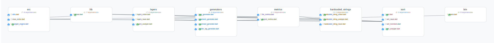
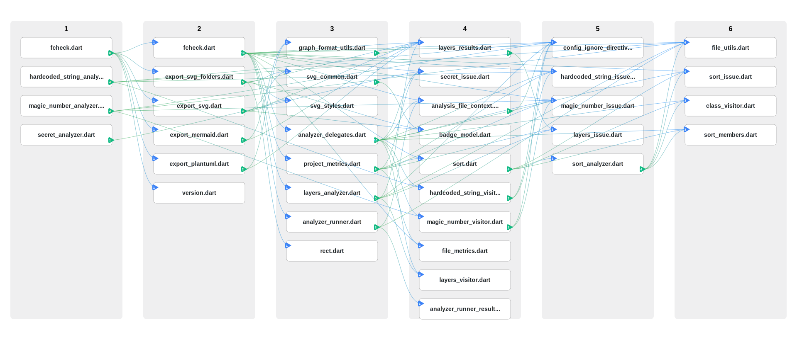

# fcheck

A command-line tool for analyzing the quality of Flutter and Dart projects. It provides comprehensive metrics including code statistics, comment ratios, and compliance with coding standards like the "one class per file" rule.

## Features

- 📊 **Project Statistics**: Total files, folders, lines of code, and comment ratios
- 📝 **Comment Analysis**: Measures code documentation levels
- ✅ **Code Quality Checks**: Validates compliance with "one class per file" rule
- 🎯 **StatefulWidget Support**: Special handling for Flutter StatefulWidget classes
- 🔍 **Hardcoded String Detection**: Identifies potentially hardcoded user-facing strings
- 🔧 **Source Code Sorting**: Ensures Flutter class members are properly organized
- 📁 **Recursive Analysis**: Scans entire project directory trees
- 🚀 **Fast CLI**: Command-line interface with simple usage

## Installation

### From Source

1. Clone the repository:

```bash
git clone https://github.com/vteam-com/fCheck.git
cd fcheck
```

1. Install dependencies:

```bash
dart pub get
```

1. Run the tool:

```bash
dart run bin/fcheck.dart --input /path/to/your/flutter/project
```

### As a Global Tool

```bash
# Activate as a global Dart package
dart pub global activate fcheck

# Run from anywhere using direct command
fcheck --input /path/to/your/project

# Or use positional arguments
fcheck /path/to/your/project
```

## Usage

### Basic Usage

```bash
# Analyze current directory
fcheck

# Analyze specific project (after global installation)
fcheck --input /path/to/project

# Use positional arguments
fcheck /path/to/project

# Use short option
fcheck -i /path/to/project
```

**Note**: Examples show global installation usage. When running from source, use `dart run fcheck` instead of `fcheck`.

### SVG Generation Mode

```bash
# Generate SVG dependency graph (after global installation)
fcheck --svg

# Generate SVG in specific project
fcheck --input /path/to/project --svg

# Use positional arguments
fcheck /path/to/project --svg

# Use short options
fcheck -i /path/to/project --svg
```

### Folder-Based SVG Generation Mode

```bash
# Generate folder-based SVG visualization (after global installation)
fcheck --svgfolder

# Generate folder-based SVG in specific project
fcheck --input /path/to/project --svgfolder

# Use positional arguments
fcheck /path/to/project --svgfolder

# Use short options
fcheck -i /path/to/project --svgfolder
```

**Folder-Based Visualization Features**:



The folder-based visualization provides:

- **Folder Containers**: Files grouped by their containing folders
- **Folder-Level Metrics**: Rollup incoming/outgoing dependency counts per folder
- **File-Level Details**: Individual files shown within each folder with their own dependency badges
- **Interactive Tooltips**: Hover over folder edges to see specific file dependencies between folders
- **Visual Hierarchy**: Folders sorted by dependency activity (most connected folders first)

This visualization helps identify:

- 📁 **Folder Coupling**: Which folders have the most inter-dependencies
- 🔗 **Architecture Patterns**: Natural grouping and separation of concerns
- 🎯 **Refactoring Opportunities**: Folders that might benefit from consolidation or separation
- 📊 **Component Relationships**: How different modules/components interact

**Visualization Example**:



The SVG visualization shows:

- **Layered Architecture**: Files organized by dependency layers (Layer 1 = entry points, higher numbers = deeper dependencies)
- **Dependency Graph**: Visual representation of file dependencies with directional edges
- **Metrics Badges**: Each file shows incoming/outgoing dependency counts
- **Interactive Features**: Hover over nodes/edges for detailed information

The visualization helps identify:

- ✅ Proper layering and separation of concerns
- ⚠️ Circular dependencies (handled via Tarjan's SCC algorithm)
- 📊 Architecture patterns and component relationships
- 🔍 Potential refactoring opportunities

### JSON Output Mode

```bash
# Output all analysis results in structured JSON format
fcheck --json

# Output JSON in specific project
fcheck --input /path/to/project --json

# Use positional arguments
fcheck /path/to/project --json
```

### Auto-Fix Mode

```bash
# Automatically fix sorting issues (after global installation)
fcheck --fix

# Fix sorting issues in specific project
fcheck --input /path/to/project --fix

# Use positional arguments
fcheck /path/to/project --fix

# Use short options
fcheck -i /path/to/project -f
```

### Example Output

```
Analyzing project at: /path/to/project...
--- Stats ---
Folders: 15
Files: 89
Dart Files: 23
Lines of Code: 2456
Comment Lines: 312
Comment Ratio: 12.70%
----------------------
❌ 3 files violate the "one class per file" rule:
  - lib/widgets.dart (4 classes found)
  - lib/main.dart (2 classes found)
  - lib/models.dart (3 classes found)

⚠️ 6 potential hardcoded strings detected:
  - lib/ui/messages.dart:15: "Welcome back!"
  - lib/screens/login.dart:42: "Please enter your password"
  - lib/widgets/buttons.dart:23: "Submit"

✅ All Flutter classes have properly sorted members.
```

## Quality Metrics

### Project Statistics

- **Total Folders**: Number of directories in the project
- **Total Files**: Total number of files (all types)
- **Total Dart Files**: Number of `.dart` files analyzed
- **Total Lines of Code**: Sum of all lines in Dart files
- **Total Comment Lines**: Lines containing comments
- **Comment Ratio**: Percentage of lines that are comments

### Code Quality Rules

#### One Class Per File Rule

- **Public Classes**: Maximum 1 public class per file (classes not starting with `_`)
- **StatefulWidget Files**: Maximum 2 public classes per file (widget + state)
- **Private Classes**: Unlimited (implementation details starting with `_`)
- **Violations**: Files with too many public classes are flagged

## Library Usage

You can also use fcheck as a Dart library in your own tools:

```dart
import 'package:fcheck/fcheck.dart';

void main() {
  final projectDir = Directory('/path/to/project');
  final engine = AnalyzerEngine(projectDir);
  final metrics = engine.analyze();

  // Access metrics programmatically
  print('Total files: ${metrics.totalFiles}');
  print('Comment ratio: ${(metrics.commentRatio * 100).toStringAsFixed(1)}%');

  // Print full report
  metrics.printReport();
}
```

## Quality Standards

### Comment Ratio Guidelines

- **Excellent**: > 20%
- **Good**: 10-20%
- **Needs Improvement**: < 10%

### Class Organization

- **Compliant**: Files with appropriate public class counts
- **StatefulWidget**: Allowed 2 public classes (widget + State)
- **Private Classes**: Unlimited (starting with `_` are implementation details)
- **Non-compliant**: Files with too many public classes

### Member Sorting (Flutter Classes)

- **Proper Order**: Constructors → Fields → Getters/Setters → Methods → Lifecycle Methods
- **Lifecycle Methods**: `initState`, `dispose`, `didChangeDependencies`, `didUpdateWidget`, `build`
- **Field Grouping**: Related getters/setters are grouped with their fields
- **Validation**: Checks if Flutter class members follow consistent organization patterns

## Project Structure

```text
fcheck/
├── bin/
│   └── fcheck.dart          # CLI entry point
├── lib/
│   ├── fcheck.dart          # Public API exports
│   └── src/
│       ├── analyzer_engine.dart           # Core analysis logic
│       ├── hardcoded_strings/             # Hardcoded string detection
│       │   ├── hardcoded_string_analyzer.dart
│       │   ├── hardcoded_string_issue.dart
│       │   └── hardcoded_string_visitor.dart
│       ├── layers/                        # Layer analysis
│       │   ├── layers_analyzer.dart
│       │   ├── layers_issue.dart
│       │   └── layers_visitor.dart
│       ├── metrics/                       # Code metrics
│       │   ├── file_metrics.dart
│       │   └── project_metrics.dart
│       ├── sort/                          # Source code sorting
│       │   ├── sort.dart
│       │   ├── sort_analyzer.dart
│       │   └── sort_members.dart
│       └── utils.dart                     # File utilities
├── example/                 # Test example project
├── pubspec.yaml             # Package configuration
└── README.md               # This file
```

## Development

### Running Tests

```bash
dart test
```

### Building

```bash
dart pub get
dart compile exe bin/fcheck.dart
```

### Testing with Example

The project includes a test example you can analyze:

```bash
dart run fcheck --input example
```

## Contributing

1. Fork the repository
2. Create a feature branch: `git checkout -b feature-name`
3. Make your changes
4. Run tests: `dart test`
5. Submit a pull request

## License

This project is licensed under the MIT License - see the LICENSE file for details.

## Requirements

- Dart SDK >= 3.0.0
- Flutter projects (for Flutter-specific analysis features)
